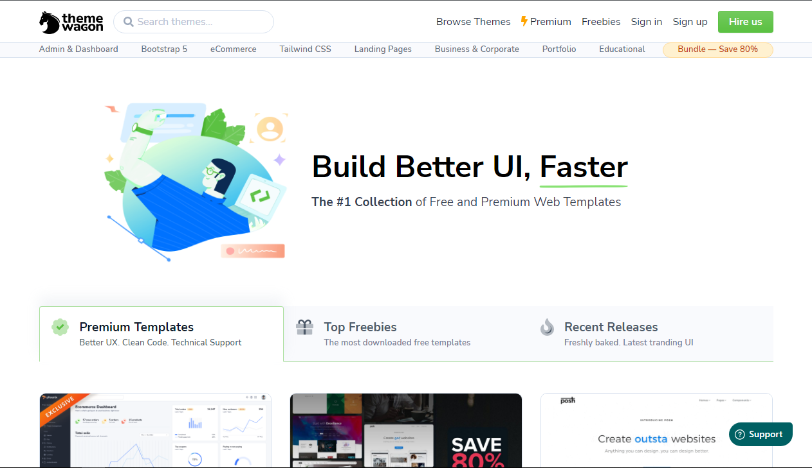
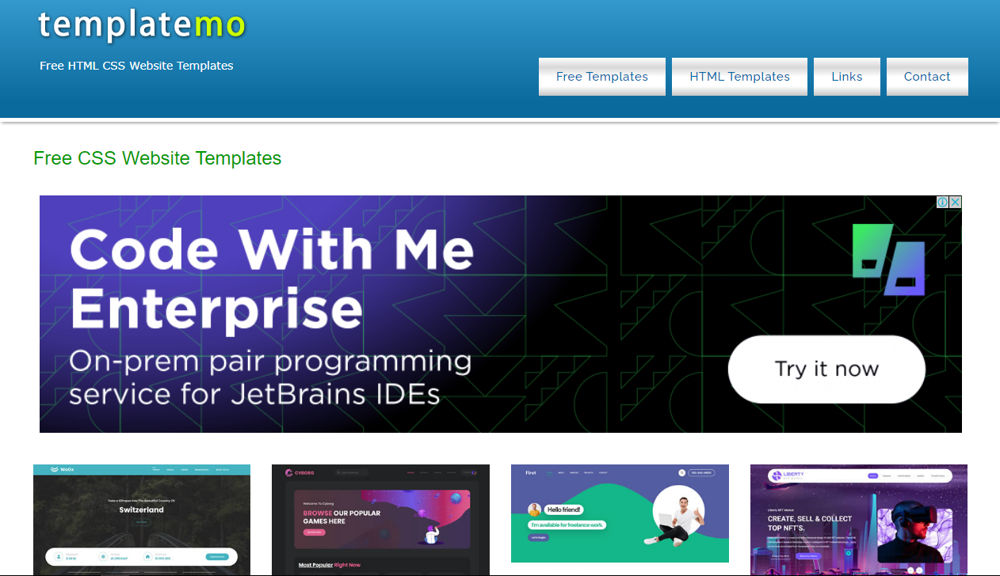
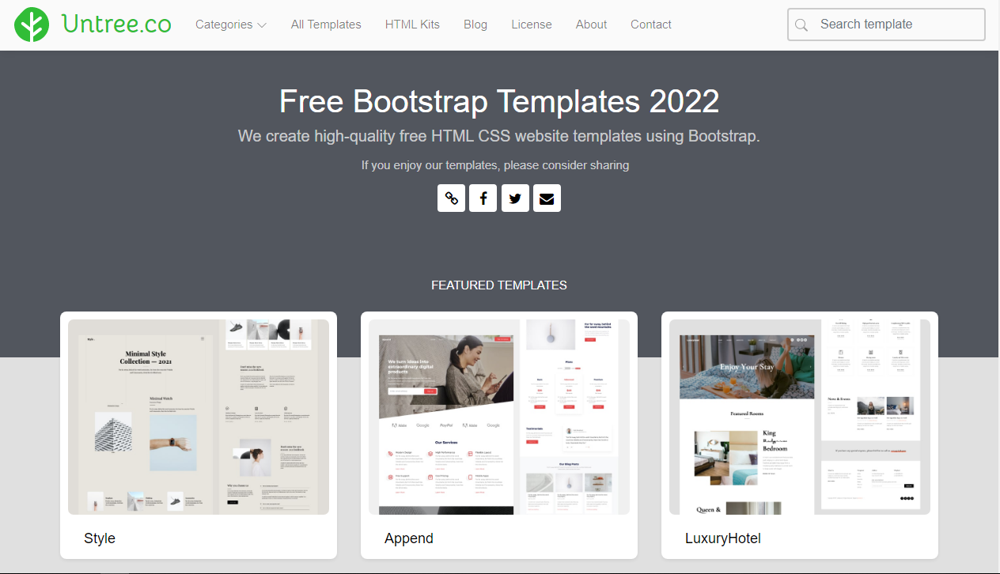
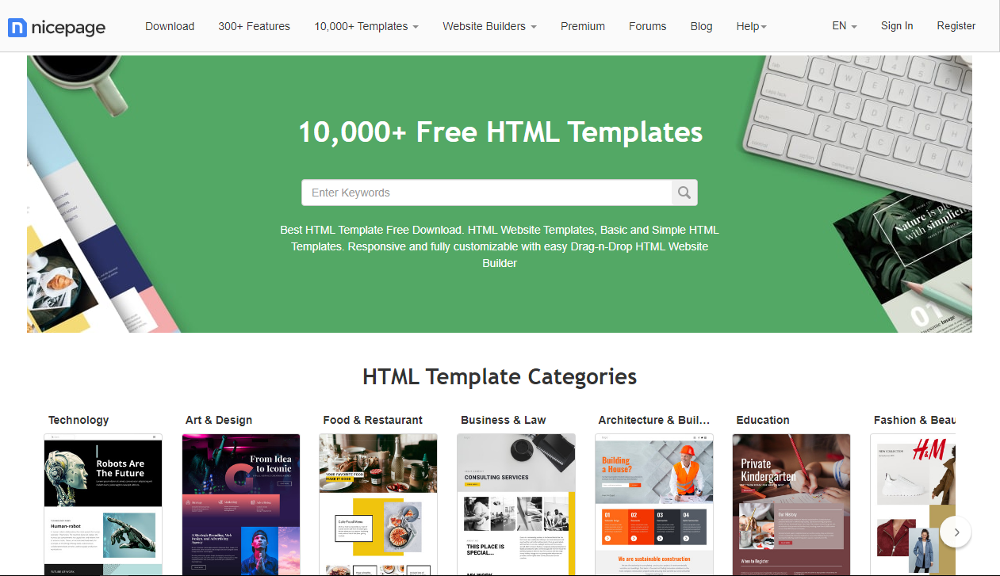
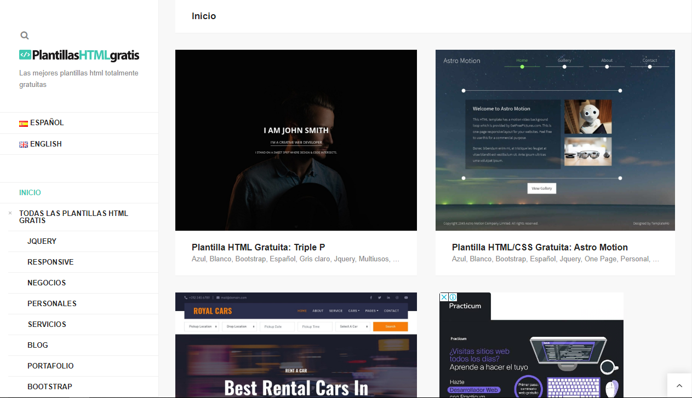
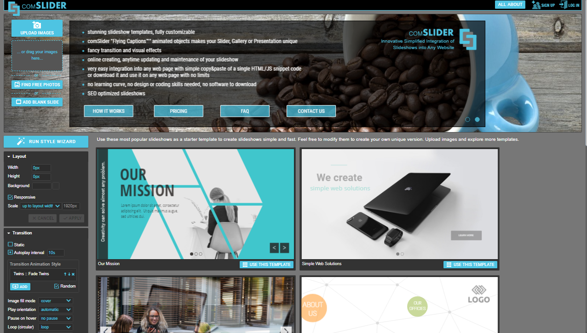

# Sitios webs que ofrecen plantillas gratuitas

## Formas de hacer sitios webs usando plantillas
* Plantillas desde cero (HTML_CSS_JS)
* Plantillas desde cero (HTML_CSS_JS_Frameworks CSS)
* Plantillas creada a partir de un diseño (.psd) 
* Plantillas creadas por algien mas (descargadas)

---

## Sitios web

### [Theme Wagon](https://themewagon.com/" target="_blank)

### [Templatemo](https://templatemo.com/page/1" target="_blank)

### [Untree](https://untree.co/" target="_blank)

### [Nicepage](https://nicepage.com/html-templates" target="_blank)

### [Plantillas HTML Gratis](https://plantillashtmlgratis.com/" target="_blank)

---

# Sitios web para generar carruseles 

### [Comslider](https://www.comslider.com/" target="_blank)

> Credenciales de prueba: 
> marcobardalesrodriguez@gmail.com | comslider/01
